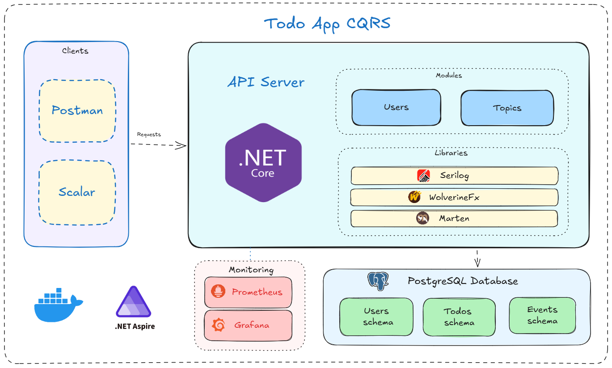
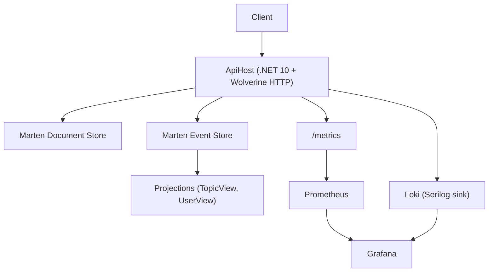
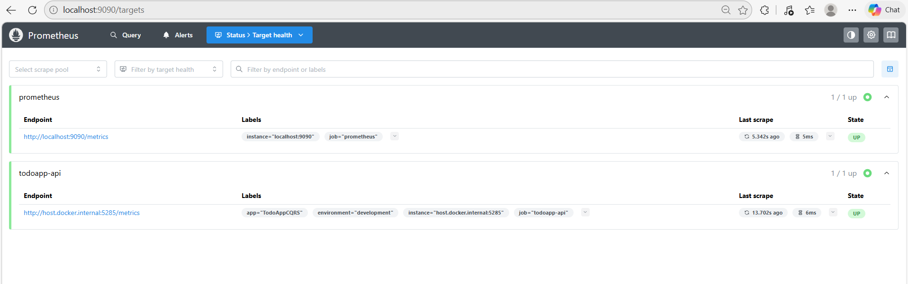
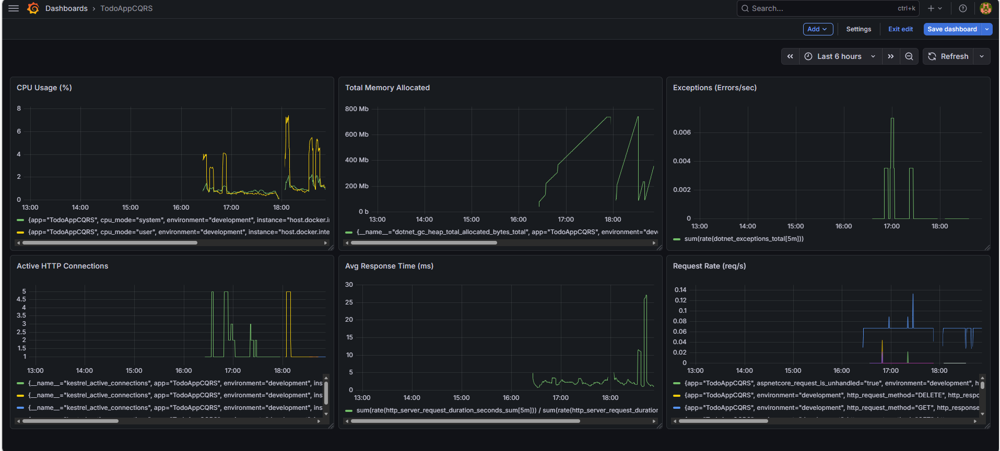
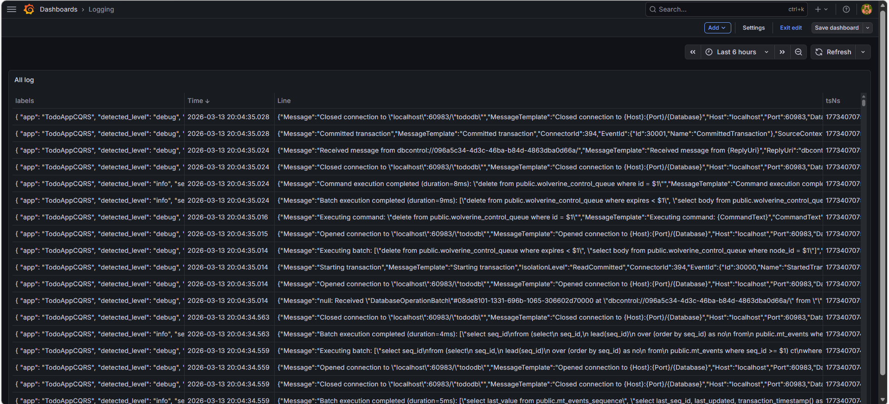

# TodoAppCQRS

A production-style backend sample that demonstrates **CQRS + Event Sourcing** with **.NET 10**, **Wolverine**, **Marten**, and **PostgreSQL**, including a ready-to-run **Prometheus/Loki/Grafana** monitoring stack.



## Table of Contents

- [1. Project Purpose](#1-project-purpose)
- [2. Tech Stack, Libraries, Tools](#2-tech-stack-libraries-tools)
- [3. Architecture and Design Patterns](#3-architecture-and-design-patterns)
- [4. Installation and Run](#4-installation-and-run)
- [5. Monitoring and Grafana Setup](#5-monitoring-and-grafana-setup)
- [6. Testing](#6-testing)
- [7. Repository Structure](#7-repository-structure)

## 1. Project Purpose

This project is built to:
- Show a practical backend structure using CQRS and Event Sourcing.
- Separate write-side behavior (commands/events) from read-side models (projections/views).
- Use Wolverine for command/event handling and Marten for document + event persistence.
- Provide observability with Prometheus, Loki, and Grafana.
- Offer reliable integration tests using real PostgreSQL instances via Testcontainers.

Current domain scope:
- `Users`
- `Topics` and `Todos` per user
- Cascade workflow behavior (for example, deleting a user triggers topic cleanup flow)

## 2. Tech Stack, Libraries, Tools

### Core Platform
- `.NET 10`
- `ASP.NET Core Minimal API`
- `PostgreSQL`

### Application Libraries
- `WolverineFx` (`WolverineFx.Http`, `WolverineFx.Marten`) for command/event processing
- `Marten` for document storage and event streams on PostgreSQL
- `FluentValidation` integrated through Wolverine HTTP middleware
- `Serilog` with:
  - `Serilog.Sinks.Grafana.Loki`
  - `Serilog.Sinks.OpenTelemetry`

### Infrastructure and Developer Tools
- `.NET Aspire AppHost` for local orchestration
- `Docker Compose` in `monitoring/` for Prometheus/Loki/Grafana
- `Scalar` for API reference UI
- `xUnit + Alba + Testcontainers` for integration testing

## 3. Architecture and Design Patterns

### High-Level Flow

- The API receives commands/queries over HTTP endpoints.
- Commands are handled by Wolverine and persisted through Marten.
- Projections build read models (`TopicView`, `UserView`) for efficient querying.
- Metrics and logs are emitted to the monitoring stack for observability.



### Applied Patterns

- `CQRS`: clear split between write and read concerns.
- `Event Sourcing` (domain level): event streams are used for aggregate evolution.
- `Projection pattern`: read models optimized for query use cases.
- `Transactional messaging / outbox` via Wolverine + Marten integration.
- `Vertical Slice Architecture` by feature (`Features/Users`, `Features/Topics`).

### Database Schema Segmentation

The project uses schema separation to reduce coupling:
- `topic` for `TopicView`
- `users` for `UserView`
- `events` for Marten event store
- `wolverine` for Wolverine message storage/transport tables

## 4. Installation and Run

### Prerequisites

- .NET SDK 10
- Docker Desktop (or Docker Engine with Compose v2)
- PowerShell 7+ (recommended on Windows)

### Start Everything with One Command

From the repository root:

```powershell
powershell -ExecutionPolicy Bypass -File .\run-all.ps1
```

This command will:
- Start monitoring stack in `monitoring/` (`Prometheus`, `Loki`, `Grafana`)
- Start app stack via `Aspire.AppHost` (`ApiHost` + PostgreSQL)

Useful endpoints:
- Grafana: `http://localhost:3000` (`admin/admin`)
- Prometheus: `http://localhost:9090`
- Loki: `http://localhost:3100`
- ApiHost URL: `http://localhost:5285`

Stop monitoring containers:

```powershell
docker compose -f .\monitoring\docker-compose.yml down
```

## 5. Monitoring and Grafana Setup

Detailed guide: `docs/monitoring_guide.md`

### Monitoring Assets in this Repository

- Compose file: `monitoring/docker-compose.yml`
- Prometheus config: `monitoring/prometheus/prometheus.yml`
- Loki config: `monitoring/loki/loki-config.yml`
- Grafana provisioning: `monitoring/grafana/provisioning`





### Important Notes

- Prometheus collects **metrics**, not logs.
- Application logs are written by Serilog:
  - directly to terminal / Aspire dashboard
  - and to Loki for Grafana log exploration (when enabled)

### Key Metrics to Track

- HTTP: `http_server_request_duration_seconds`
- Runtime: `dotnet_gc_*`, `dotnet_thread_pool_*`, `process_*`
- ASP.NET Core: `aspnetcore_*`, `kestrel_*`
- Wolverine pipeline: `wolverine_*`

### Sample PromQL Queries

Request rate:

```promql
sum(rate(http_server_request_duration_seconds_count[5m]))
```

Average response time (ms):

```promql
sum(rate(http_server_request_duration_seconds_sum[5m])) / sum(rate(http_server_request_duration_seconds_count[5m])) * 1000
```

CPU usage (%):

```promql
rate(dotnet_process_cpu_time_seconds_total[5m]) * 100
```

Exceptions per second:

```promql
sum(rate(dotnet_exceptions_total[5m]))
```

## 6. Testing

Run all backend tests:

```powershell
dotnet test tests/Tests/Tests.csproj
```

Run test + coverage script:

```powershell
powershell -ExecutionPolicy Bypass -File tests/Tests/run-backend-tests.ps1
```

Note: integration tests require Docker because PostgreSQL is provisioned by Testcontainers.

## 7. Repository Structure

```text
src/
  ApiHost/                 # HTTP API + handlers + projections
  Aspire.AppHost/          # Local orchestration (Aspire)
  Aspire.ServiceDefaults/  # Shared telemetry/service defaults
tests/
  Tests/                   # Integration/contract/regression tests
monitoring/
  docker-compose.yml       # Prometheus + Loki + Grafana
  prometheus/
  loki/
  grafana/
assets/
  architecture-diagram.png
  prometheus.png
  grafana-dashboard.png
  grafana-logging.png
```
