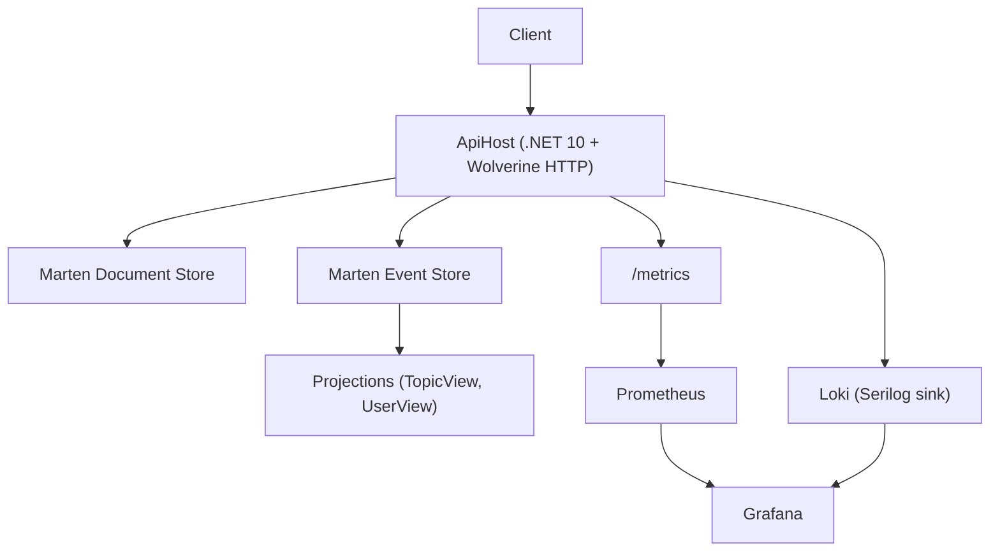

# TodoAppCQRS

Đây là dự án backend mẫu theo hướng **CQRS + Event Sourcing** trên **.NET 10**, sử dụng **Wolverine**, **Marten**, **PostgreSQL**, kèm sẵn stack quan sát hệ thống **Prometheus/Loki/Grafana**.


## Mục lục

- [1. Giới thiệu và mục đích dự án](#1-giới-thiệu-và-mục-đích-dự-án)
- [2. Tech stack, libraries, tools](#2-tech-stack-libraries-tools)
- [3. Architecture và design patterns](#3-architecture-và-design-patterns)
- [4. Cài đặt và khởi động](#4-cài-đặt-và-khởi-động)
- [5. Cấu hình monitoring và Grafana](#5-cấu-hình-monitoring-và-grafana)
- [6. Testing](#6-testing)
- [7. Cấu trúc thư mục](#7-cấu-trúc-thư-mục)

## 1. Giới thiệu và mục đích dự án

Dự án này được xây dựng để:
- Minh họa cách tổ chức backend theo CQRS và Event Sourcing.
- Tách biệt model ghi (commands/events) và model đọc (projections/views).
- Triển khai message handling bằng Wolverine và persistence bằng Marten.
- Tích hợp monitoring/observability để theo dõi hiệu năng và hành vi hệ thống.
- Cung cấp bộ integration tests chạy trên PostgreSQL thật qua Testcontainers.

Domain chính hiện tại:
- Quản lý `Users`
- Quản lý `Topics` và `Todos` theo người dùng
- Xử lý workflow cascade (ví dụ xóa user sẽ kéo theo xử lý các topic liên quan)

## 2. Tech stack, libraries, tools

### Core platform
- `.NET 10`
- `ASP.NET Core Minimal API`
- `PostgreSQL`

### Application libraries
- `WolverineFx` (`WolverineFx.Http`, `WolverineFx.Marten`) cho command/event handling
- `Marten` cho document database + event store trên PostgreSQL
- `FluentValidation` tích hợp qua Wolverine HTTP middleware
- `Serilog` + sinks:
  - `Serilog.Sinks.Grafana.Loki`
  - `Serilog.Sinks.OpenTelemetry`

### Infra and developer tools
- `.NET Aspire AppHost` để orchestration môi trường local
- `Docker Compose` trong `monitoring/` để chạy Prometheus/Loki/Grafana
- `Scalar` cho API reference UI
- `xUnit + Alba + Testcontainers` cho integration testing

## 3. Architecture và design patterns

### Kiến trúc tổng quan

- API layer nhận command/query qua HTTP endpoints.
- Command được xử lý bằng Wolverine handlers và lưu qua Marten.
- Projections cập nhật read models (`TopicView`, `UserView`) để query nhanh.
- Monitoring stack thu thập metrics/logs để quan sát hệ thống.



### Design patterns đang áp dụng

- `CQRS`: tách đường ghi (commands) và đọc (queries/views).
- `Event Sourcing` (mức độ domain): dùng stream events cho aggregate.
- `Projection pattern`: xây read model tối ưu cho truy vấn.
- `Outbox/transactional messaging` (Wolverine + Marten): tăng độ tin cậy khi xử lý message.
- `Vertical Slice` theo feature (`Features/Users`, `Features/Topics`).

### Phân tách schema database

Hiện tại đã cấu hình schema riêng để giảm coupling:
- `topic` cho dữ liệu `TopicView`
- `users` cho dữ liệu `UserView`
- `events` cho Marten event store
- `wolverine` cho message storage/transport tables

## 4. Cài đặt và khởi động

### Yêu cầu môi trường

- .NET SDK 10
- Docker Desktop (hoặc Docker Engine + Compose v2)
- PowerShell 7+ (khuyến nghị trên Windows)

### Chạy toàn bộ app bằng 1 lệnh

Từ thư mục gốc repo:

```powershell
powershell -ExecutionPolicy Bypass -File .\run-all.ps1
```

Lệnh này sẽ:
- Start monitoring stack trong `monitoring/` (`Prometheus`, `Loki`, `Grafana`)
- Start app stack qua `Aspire.AppHost` (`ApiHost` + PostgreSQL)

Sau khi chạy:
- Grafana: `http://localhost:3000` (`admin/admin`)
- Prometheus: `http://localhost:9090`
- Loki: `http://localhost:3100`
- ApiHost URL: xem trong Aspire Dashboard output

Dừng monitoring containers:

```powershell
docker compose -f .\monitoring\docker-compose.yml down
```

## 5. Cấu hình monitoring và Grafana

Tài liệu chi tiết nằm tại `docs/monitoring_guide.md`. Bên dưới là quick-start:

### 5.1 Monitoring stack trong repo

- File compose: `monitoring/docker-compose.yml`
- Prometheus config: `monitoring/prometheus/prometheus.yml`
- Loki config: `monitoring/loki/loki-config.yml`
- Grafana provisioning: `monitoring/grafana/provisioning`


### 5.2 Lưu ý về logs và metrics

- Prometheus thu thập `metrics`, không thu thập logs.
- Logs của app đi qua Serilog:
  - Xem trực tiếp trong terminal/Aspire Dashboard
  - Hoặc vào Loki/Grafana nếu đã cấu hình datasource

### 5.3 Các metrics quan trọng nên theo dõi

- HTTP performance: `http_server_request_duration_seconds`
- Runtime: `dotnet_gc_*`, `dotnet_thread_pool_*`, `process_*`
- ASP.NET Core: `aspnetcore_*`, `kestrel_*`
- Wolverine message pipeline: `wolverine_*`

### 5.4 Truy vấn PromQL mẫu

Request rate:

```promql
sum(rate(http_server_request_duration_seconds_count[5m]))
```

Average response time (ms):

```promql
sum(rate(http_server_request_duration_seconds_sum[5m])) / sum(rate(http_server_request_duration_seconds_count[5m])) * 1000
```

CPU usage (%):

```promql
rate(dotnet_process_cpu_time_seconds_total[5m]) * 100
```

Exceptions per second:

```promql
sum(rate(dotnet_exceptions_total[5m]))
```

## 6. Testing

Chạy toàn bộ backend tests:

```powershell
dotnet test tests/Tests/Tests.csproj
```

Chạy script test + coverage:

```powershell
powershell -ExecutionPolicy Bypass -File tests/Tests/run-backend-tests.ps1
```

Lưu ý: integration tests cần Docker vì PostgreSQL được cấp phát bằng Testcontainers.

## 7. Cấu trúc thư mục

```text
src/
  ApiHost/                 # HTTP API + handlers + projections
  Aspire.AppHost/          # Local orchestration (Aspire)
  Aspire.ServiceDefaults/  # Shared telemetry/service defaults
tests/
  Tests/                   # Integration/contract/regression tests
monitoring/
  docker-compose.yml       # Prometheus + Loki + Grafana
  prometheus/
  loki/
  grafana/
assets/
  architecture-diagram.png
  prometheus.png
  grafana-dashboard.png
  grafana-logging.png
```