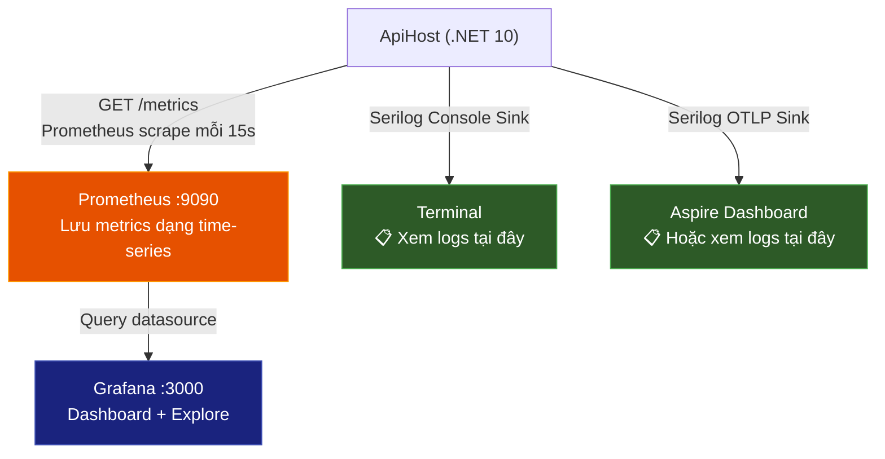

# Hướng Dẫn Sử Dụng Prometheus & Grafana cho TodoAppCQRS

## 📌 Serilog Log xem ở đâu?

> [!IMPORTANT]
> **Serilog logs KHÔNG có trong Grafana/Prometheus.** Prometheus chỉ thu thập **metrics (số liệu)**, không thu thập **logs (nhật ký)**.

Serilog logs hiện tại hiển thị ở:

| Nơi xem | Cách truy cập |
|---|---|
| **Terminal/Console** | Cửa sổ terminal đang chạy `dotnet run` — log có màu, structured |
| **Aspire Dashboard** | Chạy qua Aspire AppHost → mở Dashboard → tab **Structured Logs** |

Nếu muốn xem logs trong Grafana, cần thêm **Grafana Loki** (hệ thống thu thập logs) — đó là một bước nâng cao để làm sau.

---

## 📊 Giải thích các Metrics quan trọng

Khi vào Grafana → **Explore** → chọn datasource **Prometheus**, bạn sẽ thấy danh sách metrics dài. Đừng lo, đây là giải thích từng nhóm:

### 1. HTTP Request Metrics (`http_server_*`)

> Đo lường hiệu suất API của bạn — **quan trọng nhất cho web developer**

| Metric | Ý nghĩa | Cách dùng |
|---|---|---|
| `http_server_request_duration_seconds` | Thời gian xử lý mỗi request (giây) | Biết API nào chậm |
| `http_server_active_requests` | Số request đang xử lý đồng thời | Biết tải hiện tại |

**Query hữu ích — Tỷ lệ request/giây:**
```promql
sum(rate(http_server_request_duration_seconds_count[5m]))
```

**Query — Thời gian response trung bình (ms):**
```promql
sum(rate(http_server_request_duration_seconds_sum[5m])) / sum(rate(http_server_request_duration_seconds_count[5m])) * 1000
```

---

### 2. .NET Runtime Metrics (`dotnet_*` / `process_*`)

> Đo "sức khỏe" bên trong ứng dụng .NET

| Metric | Ý nghĩa |
|---|---|
| `process_cpu_count` | Số CPU cores |
| `dotnet_gc_collections_total` | Số lần Garbage Collector chạy |
| `dotnet_gc_heap_total_allocated_bytes_total` | Tổng bộ nhớ đã cấp phát |
| `dotnet_thread_pool_thread_count` | Số threads trong thread pool |
| `dotnet_thread_pool_work_items_total` | Số work items đã xử lý |

**Query — Memory đang sử dụng:**
```promql
dotnet_gc_heap_total_allocated_bytes_total
```

---

### 3. ASP.NET Core Metrics (`aspnetcore_*`)

> Metrics cụ thể cho ASP.NET Core framework

| Metric | Ý nghĩa |
|---|---|
| `aspnetcore_routing_match_attempts_total` | Số lần request match routing |
| `aspnetcore_diagnostics_exceptions_total` | Số exceptions xảy ra |
| `aspnetcore_rate_limiting_*` | Rate limiting metrics (nếu có) |
| `kestrel_*` | Metrics của Kestrel web server |

---

### 4. Wolverine Metrics (`wolverine_*`)

> Metrics của message handler framework — đo hiệu suất xử lý commands/events

| Metric | Ý nghĩa |
|---|---|
| `wolverine_messages_received_total` | Tổng messages nhận được |
| `wolverine_messages_succeeded_total` | Messages xử lý thành công |
| `wolverine_messages_failed_total` | Messages xử lý thất bại |
| `wolverine_execution_time_seconds` | Thời gian thực thi message handler |

---

## 🎨 Tạo Dashboard đầu tiên trong Grafana

### Bước 1: Tạo Dashboard mới
1. Sidebar trái → **Dashboards** → nút **New** → **New Dashboard**
2. Click **+ Add visualization**
3. Chọn datasource **Prometheus**

### Bước 2: Thêm Panel "Request Rate"
1. Click **Add** → **Visualization**
2. Ở phần query builder, góc trên bên phải của biểu tượng Prometheus, click vào nút **Builder**, chọn sang **Code**
3. Nhập câu query: > `sum(rate(http_server_request_duration_seconds_count[5m]))`
   *(Lưu ý: Chỉ copy phần chữ bên trong viền, không copy các ký tự dư thừa)*
4. Đặt tên (Panel title góc phải): `Request Rate (req/s)`
5. Click **Apply** (góc trên phải)

### Bước 3: Thêm Panel "Response Time"
1. Click **Add** → **Visualization**
2. Đổi sang chế độ **Code** (như Bước 2)
3. Nhập câu query: > `sum(rate(http_server_request_duration_seconds_sum[5m])) / sum(rate(http_server_request_duration_seconds_count[5m])) * 1000`
   *(Lưu ý: Chỉ copy phần chữ bên trong viền, không copy các ký tự dư thừa)*
4. Panel title: `Avg Response Time (ms)`
5. **Apply**

### Bước 4: Thêm Panel "Memory Usage"
1. **Add** → **Visualization**
2. Đổi sang chế độ **Code**
3. Nhập câu query: > `dotnet_gc_heap_total_allocated_bytes_total`
   *(Lưu ý: Chỉ copy chữ bên trong mảng mờ)*
4. Panel title: `Total Memory Allocated`
5. Ở mục **Standard options** (cột bên phải) → **Unit** → tìm và chọn **bytes (SI)**
6. **Apply**

### Bước 5: Thêm Panel "CPU Usage" (Rất quan trọng)
1. **Add** → **Visualization**
2. Đổi sang chế độ **Code**
3. Nhập câu query: > `rate(dotnet_process_cpu_time_seconds_total[5m]) * 100`
4. Panel title: `CPU Usage (%)`
5. Mục **Standard options** → **Unit** → chọn **Percent (0-100)**
6. **Apply**

### Bước 6: Thêm Panel "Exceptions Rate" (Theo dõi lỗi)
1. **Add** → **Visualization**
2. Đổi sang chế độ **Code**
3. Nhập câu query: > `sum(rate(dotnet_exceptions_total[5m]))`
4. Panel title: `Exceptions (Errors/sec)`
5. **Apply**

### Bước 7: Thêm Panel "Active Connections" (Tải server)
1. **Add** → **Visualization**
2. Đổi sang chế độ **Code**
3. Nhập câu query: > `kestrel_active_connections`
4. Panel title: `Active HTTP Connections`
5. **Apply**

### Bước 8: Lưu Dashboard
1. Click biểu tượng 💾 (Save) góc trên cùng → đặt tên `TodoAppCQRS Overview`
2. **Save**

---

## 🔍 Cách sử dụng Explore

**Explore** dùng để khám phá metrics nhanh (không cần tạo dashboard):

1. Sidebar → **Explore**
2. Datasource: **Prometheus**
3. Mở dropdown **Metric** → gõ tìm, ví dụ [http](file:///d:/DotNET/TodoAppCQRS/src/ApiHost/ApiHost.http) → chọn metric
4. Click **Run query**
5. Xem kết quả ở tab **Graph** (đồ thị) hoặc **Table** (bảng số)

**Mẹo**: 
- Dùng **Builder** mode (mặc định) nếu mới làm quen
- Chuyển sang **Code** mode khi muốn viết PromQL trực tiếp
- Time range (góc trên phải): thay đổi khoảng thời gian xem (Last 5m, Last 1h, ...)

---

## 💡 Tóm tắt kiến trúc Monitoring


